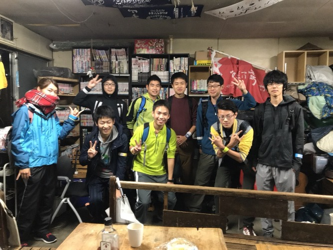
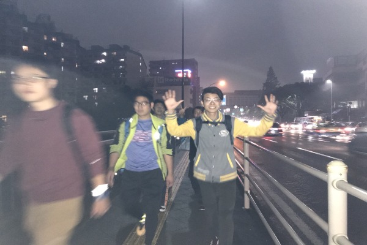
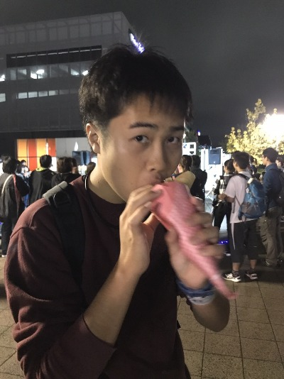
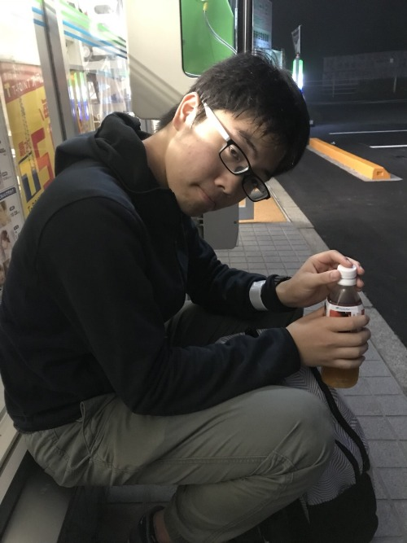
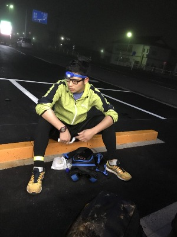
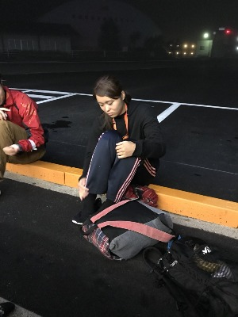
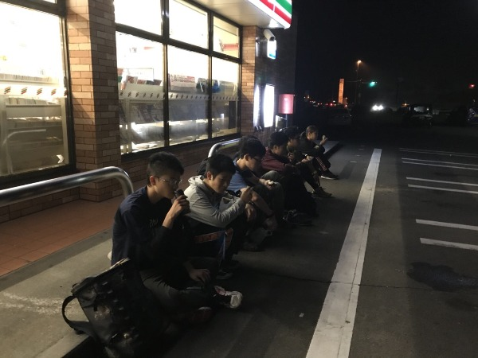

<b>B７徒歩企画 To 福島（前編）</b>

     
これは、雨ばっかりだった、ひと夏の終わりに

夜通し歩いて福島（注：この段階では市）まで80km歩いて行こうとした、

そんな９人の記録である。

たしか、イノ場氏が原氏との間で企画したものに

 B7 の志あるクソ暇人が inspireされて突如計画されたものであって、

ひたすら福島を目指して歩こうというものである。

<h4 style="text-align: left;" align="baseline">

 メンバー紹介は適当にします。

発起人のイノ場と原、そして小池、小野里、牧人、

辻、田村、僕の男衆と紅一点になってしまった野田なのだ。

 出発は 10月7日の18時だった。この時は誰しも余裕だと思っていた。

いい笑顔ですね〜。原っていつみても写真写りメチャンコいいね。

 まぁ、この記録は彼らの笑顔が消えていった記録でもある。

  

  

さて、さっそく出発しましょう。

今回の歩行のルールは

疲れをためないように1時間から2時間に一回はコンビニで休憩して

体力回復を図りながら福島に行くというものである。

ルートは４号線をずっといきます。

 
 出発から１時間くらい経過したら太白区に入れたよ。

まだまだテンション高いよ。

  

  

２時間くらいあるいたら長町についたよ。

ラーメンフェスティバルが開催されてた。

これに飛びついたのが野田。そう彼女は無類のラーメン好きなのだ。

 
ということでみんなで会場まで行ってみたはいいけど

高かったのでクレープ食べたりYoYo やってる人を見たりしたよ。 

クレープは美味しかったよ。ちなみにこれが今日の僕の夕飯でした。

  

  

　

さぁ、その後もどんどん歩いて時刻は23時くらいだっただろうか。

コンビニに滞在する時間が心なしか長くなってきた気がする。

でもまだまだ大丈夫だもんね。 ねっ。小野里君。

 見よ彼のついてこなければよかったと悟りだした顔を。 

</h4><h3 style="text-align: left;" align="baseline">

そういえば、ここのコンビニで店員さんに

どこまであるくんですか？ってきかれたなぁ。

あの店員さんも同類だったのか。

 でも、我々は進軍しなければならない。（義務感）
  

  

深夜になっていよいよつらくなってきた。

個人的にはこの時間が一番つらかった。だって、眠いもん。

でも、辛いのは僕だけではなかったみたい。

↓自親会B7でコンビニの駐車スペースを占領した之図。

今回分かったけど深夜１時のコンビニって品ぞろえすごいよ。

 たいていみんなカロリーを欲してオニギリかチョコしか食わない。

  …中編に続く

</h3>