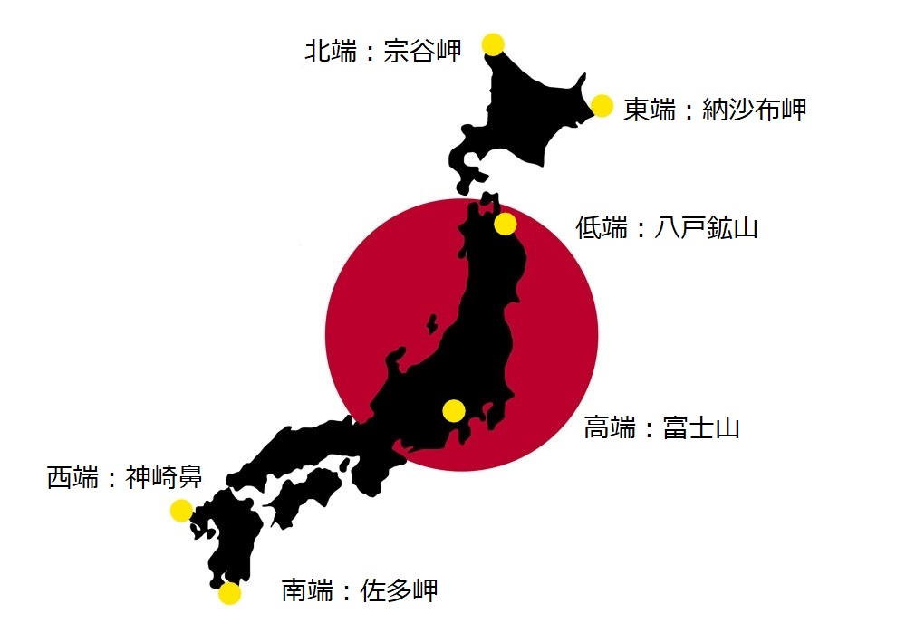

<strong>&nbsp;6端企画</strong>

6端企画とは、B6の6にちなみ、日本本土の東西南北高低の端っこ6個全部行こう！という単純明快な企画である。

3チームに分けて制覇を目指しました。

<a href="hokkaido/hokkaido_index.html">北東低端編</a>

<a href="fujisan/fujisan.html">高端編</a>

<a href="kyusyu/kyusyu.html">南西端編</a>

<a href="../../../tabi">旅行記目次</a>

